# Theme Preview

Here are all cards with themes.
| :bell: | If only show Top Languages card here, then you maybe forgot to use [Personal access token](https://docs.github.com/en/actions/configuring-and-managing-workflows/creating-and-storing-encrypted-secrets) instead of GITHUB_TOKEN in workflow. |
| :-------: | :------------------------------------------------------------------------------------------------------------------------------------------------------------------------------------------------------------------------------------------------ |

## [default](./default/README.md)

 
 [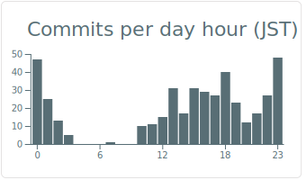](https://github.com/vn7n24fzkq/github-profile-summary-cards)
## [solarized](./solarized/README.md)
[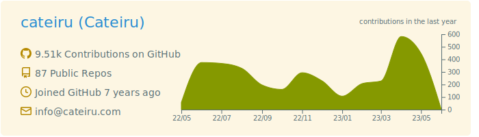](https://github.com/vn7n24fzkq/github-profile-summary-cards)
[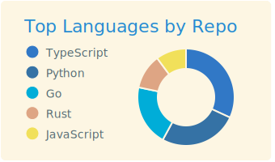](https://github.com/vn7n24fzkq/github-profile-summary-cards) [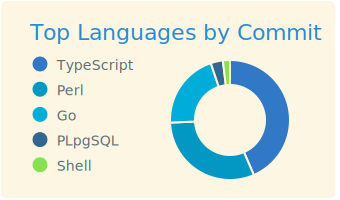](https://github.com/vn7n24fzkq/github-profile-summary-cards)
 [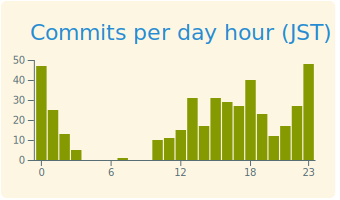](https://github.com/vn7n24fzkq/github-profile-summary-cards)
## [solarized_dark](./solarized_dark/README.md)

[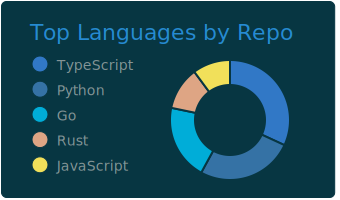](https://github.com/vn7n24fzkq/github-profile-summary-cards) [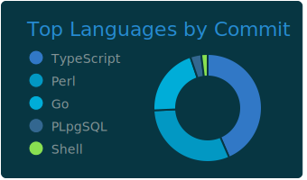](https://github.com/vn7n24fzkq/github-profile-summary-cards)
 [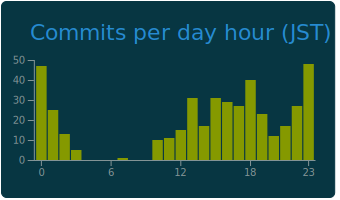](https://github.com/vn7n24fzkq/github-profile-summary-cards)
## [vue](./vue/README.md)
[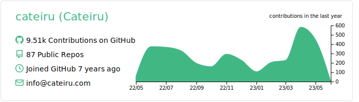](https://github.com/vn7n24fzkq/github-profile-summary-cards)
 [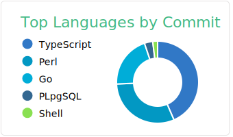](https://github.com/vn7n24fzkq/github-profile-summary-cards)
 
## [dracula](./dracula/README.md)
[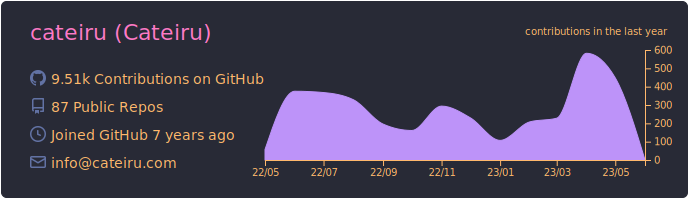](https://github.com/vn7n24fzkq/github-profile-summary-cards)
[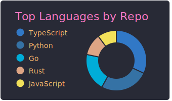](https://github.com/vn7n24fzkq/github-profile-summary-cards) [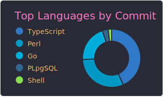](https://github.com/vn7n24fzkq/github-profile-summary-cards)
[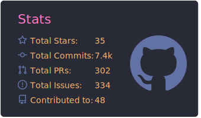](https://github.com/vn7n24fzkq/github-profile-summary-cards) [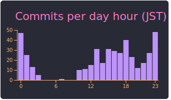](https://github.com/vn7n24fzkq/github-profile-summary-cards)
## [monokai](./monokai/README.md)
[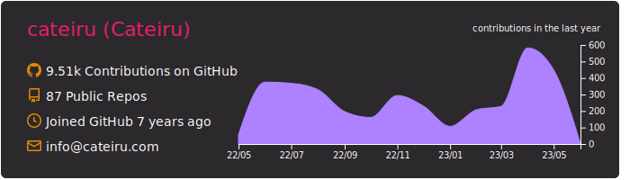](https://github.com/vn7n24fzkq/github-profile-summary-cards)
[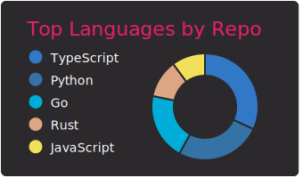](https://github.com/vn7n24fzkq/github-profile-summary-cards) [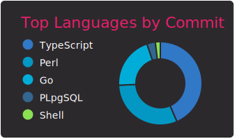](https://github.com/vn7n24fzkq/github-profile-summary-cards)
[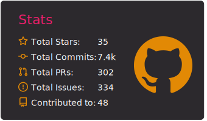](https://github.com/vn7n24fzkq/github-profile-summary-cards) [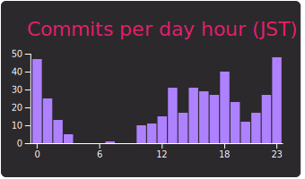](https://github.com/vn7n24fzkq/github-profile-summary-cards)
## [nord_bright](./nord_bright/README.md)
[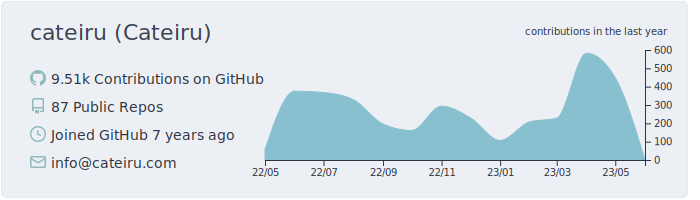](https://github.com/vn7n24fzkq/github-profile-summary-cards)
[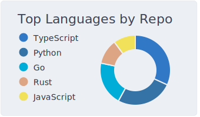](https://github.com/vn7n24fzkq/github-profile-summary-cards) [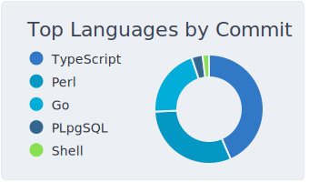](https://github.com/vn7n24fzkq/github-profile-summary-cards)
[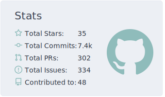](https://github.com/vn7n24fzkq/github-profile-summary-cards) [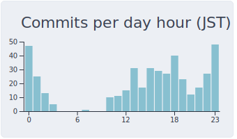](https://github.com/vn7n24fzkq/github-profile-summary-cards)
## [nord_dark](./nord_dark/README.md)
[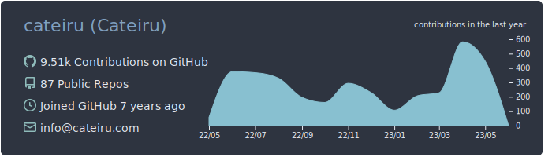](https://github.com/vn7n24fzkq/github-profile-summary-cards)
[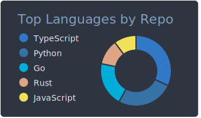](https://github.com/vn7n24fzkq/github-profile-summary-cards) 
 [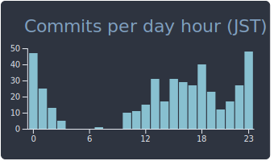](https://github.com/vn7n24fzkq/github-profile-summary-cards)
## [github](./github/README.md)
[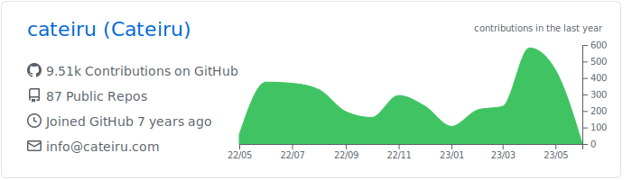](https://github.com/vn7n24fzkq/github-profile-summary-cards)
[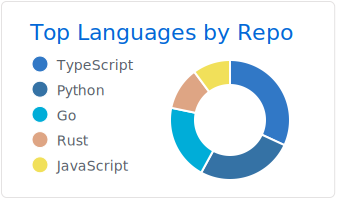](https://github.com/vn7n24fzkq/github-profile-summary-cards) [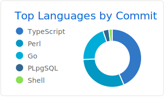](https://github.com/vn7n24fzkq/github-profile-summary-cards)
 [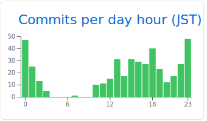](https://github.com/vn7n24fzkq/github-profile-summary-cards)
## [github_dark](./github_dark/README.md)
[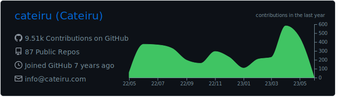](https://github.com/vn7n24fzkq/github-profile-summary-cards)
[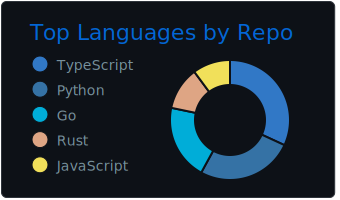](https://github.com/vn7n24fzkq/github-profile-summary-cards) [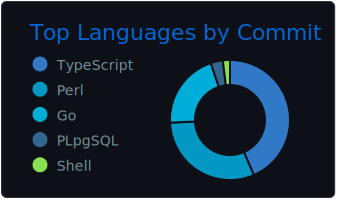](https://github.com/vn7n24fzkq/github-profile-summary-cards)
 [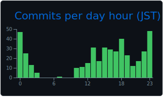](https://github.com/vn7n24fzkq/github-profile-summary-cards)
